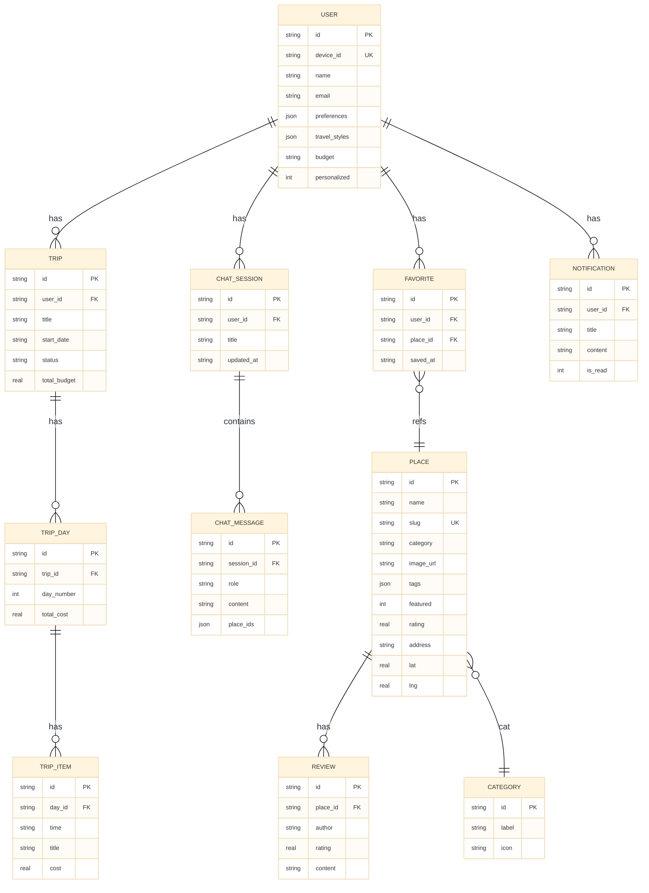
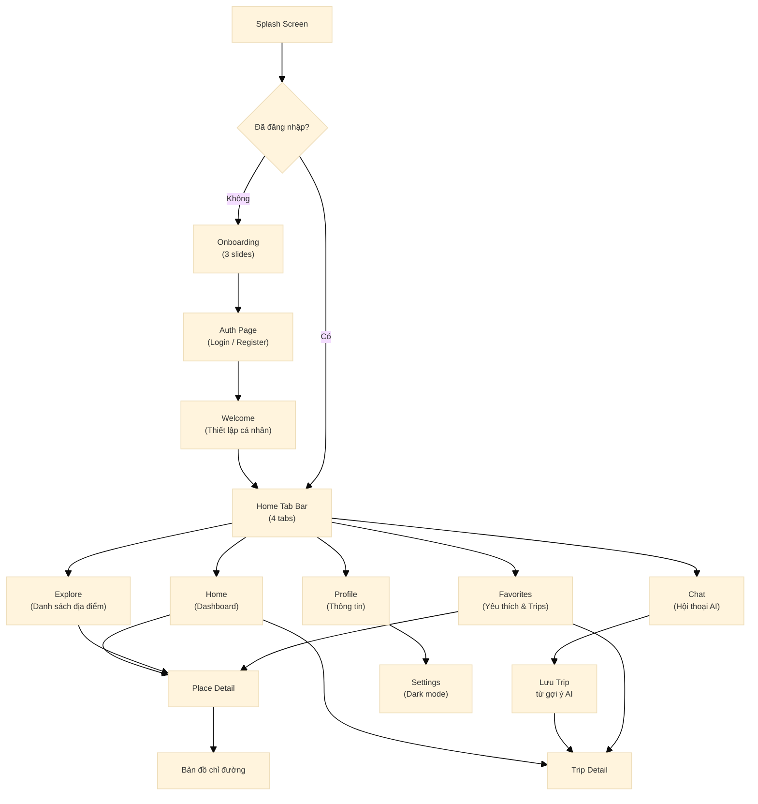

# BÁO CÁO CUỐI KỲ

# ỨNG DỤNG CHATBOT TƯ VẤN DU LỊCH ĐÀ LẠT

---

**TRƯỜNG ĐẠI HỌC ĐÀ LẠT**
**Khoa Công nghệ Thông tin**

**Học phần:** Phát triển Ứng dụng Di động Nâng cao

**Đề tài số:** 20

**Thành viên nhóm:**
- 2212338 - Lê Bình Duy Anh
- 2212379 - Lê Tiến Huy
- 2212385 - Nguyễn Huỳnh Tiến Khải

**Ngày hoàn thành:** Tháng 4/2026

---

# MỤC LỤC

- [CHƯƠNG I: MỞ ĐẦU](#chương-i-mở-đầu)
- [CHƯƠNG II: CƠ SỞ LÝ THUYẾT VÀ CÔNG NGHỆ](#chương-ii-cơ-sở-lý-thuyết-và-công-nghệ)
- [CHƯƠNG III: KHẢO SÁT VÀ PHÂN TÍCH HỆ THỐNG](#chương-iii-khảo-sát-và-phân-tích-hệ-thống)
- [CHƯƠNG IV: THIẾT KẾ HỆ THỐNG](#chương-iv-thiết-kế-hệ-thống)
- [CHƯƠNG V: XÂY DỰNG PHẦN MỀM](#chương-v-xây-dựng-phần-mềm)
- [CHƯƠNG VI: CÁC KỸ THUẬT NÂNG CAO ĐƯỢC ÁP DỤNG](#chương-vi-các-kỹ-thuật-nâng-cao-được-áp-dụng)
- [CHƯƠNG VII: TRIỂN KHAI, VẬN HÀNH VÀ KIỂM THỬ](#chương-vii-triển-khai-vận-hành-và-kiểm-thử)
- [CHƯƠNG VIII: KẾT QUẢ ĐẠT ĐƯỢC, HÌNH ẢNH MINH HỌA VÀ HƯỚNG PHÁT TRIỂN](#chương-viii-kết-quả-đạt-được-hình-ảnh-minh-họa-và-hướng-phát-triển)
- [CHƯƠNG IX: KẾT LUẬN VÀ TÀI LIỆU THAM KHẢO](#chương-ix-kết-luận-và-tài-liệu-tham-khảo)

---

# CHƯƠNG I: MỞ ĐẦU

## 1.1. Lý do chọn đề tài

Ngành du lịch Việt Nam nói chung và du lịch Đà Lạt nói riêng đang có xu hướng phát triển mạnh mẽ. Đà Lạt là một trong những điểm đến du lịch hàng đầu của Việt Nam với lợi thế về khí hậu ôn hòa, cảnh quan thiên nhiên tươi đẹp và nền ẩm thực phong phú. Tuy nhiên, du khách thường gặp khó khăn trong việc tìm kiếm thông tin về các địa điểm du lịch, lên kế hoạch lịch trình và lựa chọn dịch vụ phù hợp.

Trong bối cảnh công nghệ di động ngày càng phổ biến, việc xây dựng một ứng dụng di động thông minh hỗ trợ du khách trở nên cần thiết. Đặc biệt, công nghệ Chatbot tích hợp Trí tuệ Nhân tạo (AI) cho phép tương tác tự nhiên bằng ngôn ngữ tự nhiên, giúp người dùng dễ dàng nhận được tư vấn cá nhân hóa mà không cần kiến thức kỹ thuật.

Ionic Framework là nền tảng phát triển ứng dụng di động đa nền tảng được lựa chọn vì khả năng sử dụng chung mã nguồn cho cả iOS và Android, tích hợp tốt với Angular và hệ sinh thái phong phú của các plugin native. Kết hợp với Google Firebase làm Backend-as-a-Service (BaaS), dự án đảm bảo khả năng mở rộng, đồng thời giảm thiểu chi phí vận hành server.

## 1.2. Mục tiêu nghiên cứu

Mục tiêu chính của đề tài là xây dựng một ứng dụng di động chatbot tư vấn du lịch Đà Lạt, cho phép người dùng:

- Tương tác với chatbot AI bằng ngôn ngữ tự nhiên để được tư vấn về các địa điểm du lịch, ẩm thực, và lịch trình phù hợp.
- Khám phá và tìm kiếm các địa điểm du lịch tại Đà Lạt theo danh mục, xếp hạng và vị trí.
- Lưu trữ các địa điểm yêu thích và lên kế hoạch chuyến đi với chi tiết ngày, chi phí.
- Xem thông tin thời tiết, định vị các địa điểm gần nhất và mở bản đồ chỉ đường.
- Đăng nhập bằng nhiều phương thức (Email/Password, Google) và sử dụng cả khi không có kết nối mạng.

## 1.3. Phạm vi nghiên cứu

- **Nền tảng:** Ứng dụng di động Android và iOS, xuất file cài đặt .apk cho Android.
- **Địa bàn:** Tập trung vào các địa điểm du lịch trong khu vực thành phố Đà Lạt, tỉnh Lâm Đồng.
- **Công nghệ:** Ionic Framework + Angular (TypeScript), Firebase (Firestore, Auth, Storage), SQLite (backend), OpenAI/Gemini API cho chatbot.
- **Thời gian:** Phát triển trong học kỳ của học phần Phát triển Ứng dụng Di động Nâng cao.

## 1.4. Phương pháp nghiên cứu

- **Nghiên cứu tài liệu:** Tìm hiểu các tài liệu về Ionic Framework, Angular, Firebase, các nghiên cứu về ứng dụng chatbot trong du lịch.
- **Phân tích yêu cầu:** Thu thập yêu cầu từ đề bài, phân tích và đặc tả use-case.
- **Thiết kế hệ thống:** Thiết kế kiến trúc, cơ sở dữ liệu, giao diện người dùng.
- **Phát triển phần mềm:** Phát triển theo mô hình tiếp cận, kiểm thử và hoàn thiện.
- **Quản lý dự án:** Sử dụng GitHub để quản lý mã nguồn và phân công công việc giữa các thành viên nhóm.

## 1.5. Kết quả đạt được

- Xây dựng hoàn chỉnh ứng dụng di động chatbot tư vấn du lịch Đà Lạt trên nền tảng Ionic với giao diện thân thiện, hỗ trợ cả chế độ sáng và tối.
- Tích hợp thành công chatbot AI cho phép người dùng tương tác tự nhiên bằng tiếng Việt.
- Triển khai backend server xử lý API và tích hợp AI, có thể truy cập từ xa qua Cloudflare Tunnel.
- Đóng gói thành công file .apk chạy trên thiết bị Android thực.
- Quản lý mã nguồn tập trung trên GitHub với phân công vai trò rõ ràng giữa các thành viên.

---

# CHƯƠNG II: CƠ SỞ LÝ THUYẾT VÀ CÔNG NGHỆ

## 2.1. Tổng quan về ứng dụng di động

Ứng dụng di động (Mobile Application) là phần mềm được thiết kế để chạy trên các thiết bị di động như điện thoại thông minh và máy tính bảng. So với ứng dụng web, ứng dụng di động có lợi thế về trải nghiệm người dùng (native feel), khả năng truy cập các tính năng phần cứng (camera, GPS, cảm biến), và có thể hoạt động offline.

Có ba hướng tiếp cận chính trong phát triển ứng dụng di động: (1) Native App phát triển riêng cho từng nền tảng (Swift/Kotlin), (2) Web App chạy trên trình duyệt, và (3) Cross-Platform App sử dụng chung mã nguồn cho nhiều nền tảng. Đề tài này lựa chọn hướng thứ ba nhờ ưu điểm về thời gian phát triển và chi phí bảo trì.

## 2.2. Các nền tảng phát triển ứng dụng di động đa nền tảng

| Tiêu chí | Ionic | React Native | Flutter |
|----------|-------|-------------|---------|
| Ngôn ngữ | TypeScript/Angular | JavaScript/React | Dart |
| Hiệu năng | Tốt (WebView) | Khá tốt | Rất tốt (native) |
| Độ phổ biến | Cao | Rất cao | Cao |
| Giao diện UI | Web-based components | Native components | Custom widgets |
| Hệ sinh thái | Phong phú (Capacitor/Cordova) | Rất phong phú | Đang phát triển |
| Đường cong học tập | Trung bình | Cao | Cao |

Ionic được chọn vì tích hợp sẵn với Angular (framework mạnh mẽ, có cấu trúc rõ ràng), hỗ trợ tốt các plugin native qua Capacitor, và cho phép xuất ra ứng dụng web PWA hoặc native APK/IPA.

## 2.3. Giới thiệu Ionic Framework và Angular

**Ionic Framework** là một framework mã nguồn mở dùng để xây dựng ứng dụng di động đa nền tảng chất lượng cao. Ionic sử dụng HTML, CSS và JavaScript/TypeScript để tạo giao diện native, đồng thời tích hợp Capacitor để đóng gói thành ứng dụng Android (APK) và iOS.

Phiên bản Ionic 8 được sử dụng trong đề tài, tích hợp sâu với Angular 20 và hỗ trợ tối đa các tính năng hiện đại như Angular Signals, Standalone Components và Lazy Loading.

**Angular** là framework phát triển web front-end do Google phát triển, sử dụng TypeScript làm ngôn ngữ chính. Angular cung cấp kiến trúc component-based, two-way data binding, dependency injection và hệ thống module phong phú. Đặc biệt, Angular 17 trở lên hỗ trợ Standalone Components cho phép mỗi component độc lập mà không cần khai báo NgModule.

Các công nghệ liên quan:

- **TypeScript:** Ngôn ngữ lập trình superset của JavaScript, bổ sung kiểu tĩnh và các tính năng OOP hiện đại.
- **SCSS (Sass):** Ngôn ngữ mở rộng cho CSS, hỗ trợ biến, mixin, nesting, giúp quản lý stylesheet hiệu quả.
- **Tailwind CSS:** Utility-first CSS framework cho phép styling nhanh chóng qua các class tiện ích.
- **RxJS:** Thư viện xử lý lập trình reactive, hỗ trợ Observable pattern cho các thao tác bất đồng bộ.

## 2.4. Google Firebase

**Firebase** là nền tảng Backend-as-a-Service (BaaS) của Google, cung cấp nhiều dịch vụ cloud được sử dụng trong đề tài:

- **Firebase Firestore:** Cơ sở dữ liệu NoSQL cloud, lưu trữ dữ liệu dạng document-collection, hỗ trợ real-time listeners, offline persistence. Trong đề tài, Firestore được dùng để lưu trữ chat sessions, favorites, trips và user profiles với khả năng đồng bộ real-time giữa các thiết bị.
- **Firebase Authentication:** Dịch vụ xác thực người dùng, hỗ trợ nhiều phương thức đăng nhập như Email/Password, Google Sign-In, Facebook và Apple. Đề tài sử dụng Email/Password và Google Sign-In.
- **Firebase Storage:** Lưu trữ file trên cloud (hình ảnh, video), với SDK phong phú cho web và mobile. Dùng để lưu ảnh đại diện người dùng và ảnh được gửi trong chat.
- **Firebase Hosting:** Dịch vụ hosting static content, được dùng để deploy web build của ứng dụng Ionic.

Firebase Security Rules được thiết lập để đảm bảo chỉ người dùng đã xác thực mới có quyền truy cập dữ liệu cá nhân của họ.

## 2.5. Chatbot và Ứng dụng Trí tuệ Nhân tạo trong du lịch

**Chatbot** là chương trình máy tính được thiết kế để mô phỏng cuộc trò chuyện với con người, thông qua văn bản hoặc giọng nói. Chatbot truyền thống sử dụng các quy tắc và từ khóa cố định, trong khi chatbot AI hiện đại sử dụng Large Language Model (LLM) để hiểu ngữ cảnh và phản hồi linh hoạt.

Trong lĩnh vực du lịch, chatbot có thể:

- Tư vấn địa điểm dựa trên sở thích và ngân sách của du khách.
- Lên lịch trình chi tiết theo số ngày và mục đích chuyến đi.
- Cung cấp thông tin thời gian thực về thời tiết, giá cả, đánh giá.
- Trả lời các câu hỏi thường gặp một cách nhanh chóng 24/7.

Đề tài sử dụng OpenAI API (thông qua proxy hoặc trực tiếp) làm engine AI cho chatbot, với model mặc định là `gpt-4o-mini` hoặc `gemini-3-flash` qua API proxy. Backend server xử lý các yêu cầu chat, quản lý lịch sử hội thoại và trích xuất thông tin địa điểm từ câu trả lời của AI.

## 2.6. SQLite - Cơ sở dữ liệu cục bộ

**SQLite** là hệ quản trị cơ sở dữ liệu quan hệ nhẹ, không cần server, lưu trữ toàn bộ dữ liệu trong một file. Trong đề tài, SQLite được sử dụng trên backend server (chạy trên Node.js) để lưu trữ dữ liệu địa điểm du lịch, danh mục, đánh giá, chat sessions, trips và notifications.

Ưu điểm của SQLite: không cần cài đặt database server riêng, hiệu năng tốt cho dữ liệu có quy mô vừa và nhỏ, dễ sao lưu (chỉ cần copy file .db), và tương thích hoàn toàn với Node.js qua thư viện `better-sqlite3`.

## 2.7. Các công cụ bổ trợ

**Capacitor** là runtime cross-platform cho phép đóng gói ứng dụng web (Ionic/Angular) thành ứng dụng native Android/iOS. Capacitor thay thế Cordova với API ổn định hơn, hỗ trợ tốt hơn cho các plugin native. Đề tài sử dụng Capacitor phiên bản 8.2.0 với các plugin: Geolocation, Camera, Browser, Haptics, Keyboard, Network, StatusBar và App.

**PM2** (Process Manager 2) là công cụ quản lý process cho Node.js, cho phép chạy backend server như một daemon service, tự động khởi động lại khi crash và lưu trạng thái khi restart.

**Cloudflare Tunnel** là dịch vụ cho phép expose server local ra Internet thông qua kết nối bảo mật tới Cloudflare, không cần mở port trên router hay firewall. Backend server được triển khai trên thiết bị Android (Termux) và expose qua Cloudflare Tunnel với domain `https://chatbot.kaih.co.uk`.

---

# CHƯƠNG III: KHẢO SÁT VÀ PHÂN TÍCH HỆ THỐNG

## 3.1. Khảo sát thực tế

Đà Lạt là thành phố du lịch nổi tiếng của Việt Nam với hàng triệu lượt khách mỗi năm. Tuy nhiên, việc tìm kiếm thông tin du lịch chủ yếu dựa vào các nguồn như Google Maps, các trang web đánh giá hoặc mạng xã hội, chưa có công cụ tư vấn tập trung và thông minh cho du khách.

Qua khảo sát, nhóm nhận thấy nhu cầu thực tế của du khách bao gồm: tìm địa điểm ăn uống và check-in theo sở thích, lên kế hoạch lịch trình hợp lý, biết thời tiết để chuẩn bị trang phục, và lưu lại các địa điểm yêu thích để quay lại. Chatbot AI là giải pháp phù hợp để đáp ứng toàn bộ các nhu cầu này trong một ứng dụng di động duy nhất.

## 3.2. Yêu cầu hệ thống

### 3.2.1. Yêu cầu chức năng

**Quản lý người dùng:**
- Đăng ký tài khoản bằng Email/Password.
- Đăng nhập bằng Email/Password hoặc tài khoản Google.
- Chế độ khách (guest) với giới hạn tính năng.
- Đăng xuất và cập nhật thông tin cá nhân.

**Chatbot AI:**
- Gửi và nhận tin nhắn với AI theo thời gian thực.
- Streaming response (hiển thị câu trả lời từng phần).
- Gửi ảnh trong cuộc trò chuyện (chụp hoặc chọn từ thư viện).
- Lưu trữ lịch sử chat sessions.
- Trích xuất địa điểm từ câu trả lời AI để tạo trip.
- Chọn model AI khác nhau (Gemini 3.1 Pro High / Gemini 3 Flash).

**Khám phá địa điểm:**
- Xem danh sách địa điểm theo danh mục (đặc sản, cafe, ẩm thực, check-in, thiên nhiên, homestay, thuê xe).
- Tìm kiếm địa điểm theo tên.
- Xem chi tiết địa điểm: hình ảnh, đánh giá, địa chỉ, giờ mở cửa, số điện thoại.
- Mở bản đồ chỉ đường đến địa điểm.
- Xem thông tin thời tiết hiện tại và dự báo 5 ngày.

**Yêu thích và Lịch trình:**
- Lưu/bỏ lưu địa điểm yêu thích.
- Xem danh sách địa điểm yêu thích và trips đã lưu.
- Tạo, chỉnh sửa, xóa trip với chi tiết ngày, chi phí và lịch trình.
- Chat với AI để tạo trip tự động từ cuộc trò chuyện.

**Tính năng Native:**
- Định vị vị trí hiện tại và gợi ý địa điểm gần nhất.
- Kiểm tra trạng thái mạng, hiển thị cảnh báo khi offline.
- Chụp ảnh hoặc chọn ảnh từ thư viện để gửi trong chat.

**Cá nhân hóa:**
- Bước thiết lập ban đầu: nhập tên, chọn sở thích, phong cách du lịch, ngân sách.
- Dark mode / Light mode.

### 3.2.2. Yêu cầu phi chức năng

- **Hiệu năng:** Ứng dụng khởi động nhanh qua Lazy Loading; thời gian phản hồi chat < 5 giây.
- **Tính khả dụng:** Giao diện đơn giản, dễ sử dụng; hỗ trợ offline cho các tính năng cơ bản.
- **Bảo mật:** Firebase Security Rules bảo vệ dữ liệu; API key và secrets được quản lý qua environment variables.
- **Khả năng mở rộng:** Kiến trúc modular cho phép thêm tính năng mới; backend server có thể deploy lên cloud.
- **Tương thích:** Hỗ trợ Android (API 22+) và iOS (12+); responsive trên nhiều kích thước màn hình.

## 3.3. Biểu đồ Use-case

```
                    ┌──────────────────────────────────────┐
                    │        HỆ THỐNG CHATBOT              │
                    │        DU LỊCH ĐÀ LẠT               │
                    └──────────────────────────────────────┘

         ┌──────────────────┐         ┌──────────────────────────┐
         │      KHÁCH       │         │    NGƯỜI DÙNG           │
         │   (Chưa đăng nhập)│         │   (Đã xác thực)         │
         └───────┬──────────┘         └────────────┬─────────────┘
                 │                                 │
                 │ ○ Xem trang chủ / khám phá       │
                 │ ○ Xem chi tiết địa điểm          │
                 │ ○ Xem thời tiết                  │ ◄──── Lưu địa điểm
                 │ ○ Chat với AI (giới hạn)         │         yêu thích
                 │                                  │ ◄──── Lên lịch trình
                 │                                  │         (trip)
                 ├──────────────────────────────────┤ ◄──── Xem lịch sử chat
                 │  Đăng nhập / Đăng ký / Google    │ ◄──── Cập nhật profile
                 │                                  │ ◄──── Gửi ảnh trong chat
                 │                                  │ ◄──── Định vị GPS
                 │                                  │ ◄──── Tạo preferences
                 └──────────────────────────────────┘ ◄──── Bật/tắt dark mode
```

## 3.4. Đặc tả Use-case chính

**UC-01: Đăng nhập/Đăng ký**
- Tác nhân: Khách (chưa xác thực)
- Mô tả: Người dùng nhập email và mật khẩu để đăng nhập hoặc đăng ký tài khoản mới. Ngoài ra, có thể đăng nhập nhanh bằng tài khoản Google.
- Dòng chính: Nhập thông tin -> Validate -> Gọi Firebase Auth -> Đồng bộ user với backend -> Chuyển hướng.
- Dòng phụ: Email không hợp lệ, mật khẩu yếu, tài khoản đã tồn tại, lỗi mạng.

**UC-02: Trò chuyện với Chatbot AI**
- Tác nhân: Người dùng đã đăng nhập
- Mô tả: Người dùng gõ tin nhắn hoặc gửi ảnh để được AI tư vấn về du lịch Đà Lạt.
- Dòng chính: Gửi tin nhắn -> Gọi API /api/chat -> Nhận phản hồi (streaming) -> Hiển thị bubble -> Lưu vào Firestore.
- Dòng phụ: Không có kết nối mạng, AI trả lời quá lâu, gửi ảnh không hợp lệ.

**UC-03: Khám phá địa điểm**
- Tác nhân: Người dùng (cả khách và đã đăng nhập)
- Mô tả: Người dùng duyệt danh sách địa điểm theo danh mục, tìm kiếm và xem chi tiết.
- Dòng chính: Chọn danh mục -> Tải danh sách từ Firestore/API -> Hiển thị card -> Chọn xem chi tiết -> Mở bản đồ.

**UC-04: Lưu địa điểm yêu thích**
- Tác nhân: Người dùng đã đăng nhập
- Mô tả: Người dùng lưu hoặc bỏ lưu địa điểm, danh sách yêu thích được đồng bộ qua Firestore.
- Dòng chính: Nhấn icon trái tim -> Toggle Firestore -> Cập nhật UI.

**UC-05: Tạo và quản lý lịch trình (Trip)**
- Tác nhân: Người dùng đã đăng nhập
- Mô tả: Người dùng tạo trip mới với thông tin ngày đi, địa điểm và chi phí. Có thể tạo từ gợi ý của AI trong chat.
- Dòng chính: Nhấn "Lưu trip" trong chat -> Điền thông tin -> Lưu vào Firestore -> Hiển thị trong danh sách trips.

---

# CHƯƠNG IV: THIẾT KẾ HỆ THỐNG

## 4.1. Sơ đồ kiến trúc hệ thống

Hệ thống được thiết kế theo kiến trúc phân lớp gồm 3 tầng chính:

```mermaid
%%{init:{'theme':'base','themeVariables':{'fontSize':'11px'}}}%%
flowchart LR
    subgraph T1["TẦNG 1: CLIENT"]
        UI["Ionic UI (HTML/SCSS)"]
        NG["Angular Services"]
        CP["Capacitor Plugins
(Camera, Geo, Network)"]
        FF["Firebase
(Firestore, Auth, Storage)"]
        LS["Local Storage
(Offline Cache)"]
        SM["Angular Signals"]
    end

    T1 --> |HTTPS| T2

    subgraph T2["TẦNG 2: BACKEND API"]
        EX["Express.js Router"]
        RL["Rate Limiter"]
        AI["OpenAI / Gemini
AI Generation"]
        SQ["SQLite Database"]
        RE["Recommender"]
        IP["Image Pool"]
        FB["Firebase Admin
JWT Verification"]
    end

    T2 --> T3

    subgraph T3["TẦNG 3: DATA"]
        SQL["SQLite
(places, users,
chat_sessions)"]
        FBC["Firebase Cloud
(Firestore, Auth,
Storage)"]
    end
```



## 4.2. Sơ đồ phân rã chức năng

```mermaid
%%{init:{'theme':'base','themeVariables':{'fontSize':'10px'}}}%%
flowchart TB
    ROOT["CHATBOT DU LỊCH ĐÀ LẠT"]

    ROOT --> F1["1. Quản lý người dùng"]
    F1 --> F11["1.1 Đăng ký"]
    F1 --> F12["1.2 Đăng nhập"]
    F1 --> F13["1.3 Guest"]
    F1 --> F14["1.4 Đăng xuất"]
    F1 --> F15["1.5 Cập nhật hồ sơ"]

    ROOT --> F2["2. Chatbot AI"]
    F2 --> F21["2.1 Gửi/nhận tin nhắn"]
    F2 --> F22["2.2 Gửi ảnh"]
    F2 --> F23["2.3 Streaming"]
    F2 --> F24["2.4 Chọn model"]
    F2 --> F25["2.5 Lưu lịch sử"]
    F2 --> F26["2.6 Trích xuất địa điểm"]

    ROOT --> F3["3. Khám phá địa điểm"]
    F3 --> F31["3.1 Danh sách theo danh mục"]
    F3 --> F32["3.2 Tìm kiếm"]
    F3 --> F33["3.3 Chi tiết địa điểm"]
    F3 --> F34["3.4 Bản đồ chỉ đường"]
    F3 --> F35["3.5 Thời tiết"]

    ROOT --> F4["4. Yêu thích"]
    F4 --> F41["4.1 Thêm/bỏ"]
    F4 --> F42["4.2 Danh sách"]

    ROOT --> F5["5. Lịch trình (Trips)"]
    F5 --> F51["5.1 Tạo trip"]
    F5 --> F52["5.2 Danh sách trips"]
    F5 --> F53["5.3 Chi tiết"]
    F5 --> F54["5.4 Chỉnh sửa"]
    F5 --> F55["5.5 Xóa"]

    ROOT --> F6["6. Tính năng Native"]
    F6 --> F61["6.1 Định vị GPS"]
    F6 --> F62["6.2 Kiểm tra mạng"]
    F6 --> F63["6.3 Camera"]

    ROOT --> F7["7. Cài đặt"]
    F7 --> F71["7.1 Dark/Light mode"]
    F7 --> F72["7.2 Thông tin app"]
    F7 --> F73["7.3 Thông báo"]
```



## 4.3. Thiết kế cơ sở dữ liệu

### 4.3.1. Mô hình ER (Entity-Relationship)



### 4.3.2. Mô hình quan hệ (SQLite - Backend)

**Bảng users:**
| Trường | Kiểu | Mô tả |
|--------|------|--------|
| id | TEXT PK | UUID người dùng |
| device_id | TEXT UNIQUE | Device ID |
| name | TEXT | Tên hiển thị |
| avatar | TEXT | URL avatar |
| email | TEXT | Email |
| preferences | TEXT (JSON) | Mảng sở thích |
| travel_styles | TEXT (JSON) | Mảng phong cách |
| budget | TEXT | Ngân sách (budget/low/mid/luxury) |
| has_personalized | INTEGER | Đã cá nhân hóa chưa |
| created_at | TEXT | Thời gian tạo |

**Bảng places:**
| Trường | Kiểu | Mô tả |
|--------|------|--------|
| id | TEXT PK | UUID địa điểm |
| name | TEXT | Tên địa điểm |
| slug | TEXT UNIQUE | Slug URL-friendly |
| category | TEXT | Danh mục |
| image_url | TEXT | URL hình ảnh |
| tags | TEXT (JSON) | Tags |
| suitable_for | TEXT (JSON) | Phù hợp cho |
| featured | INTEGER | Địa điểm nổi bật |
| rating | REAL | Điểm đánh giá |
| address | TEXT | Địa chỉ |
| lat / lng | REAL | Tọa độ |
| price_range | TEXT | Mức giá |

**Bảng chat_sessions / chat_messages:** Lưu trữ lịch sử hội thoại.

**Bảng trips / trip_days / trip_items:** Lưu trữ lịch trình du lịch với chi tiết ngày và chi phí.

### 4.3.3. Cấu trúc Firestore (NoSQL - Real-time data)

Firestore được dùng cho dữ liệu cần đồng bộ real-time và dữ liệu cá nhân của người dùng:

```
users/{uid}/
  chatSessions/{sessionId}/
    messages/{messageId}
  favorites/{placeId}
  trips/{tripId}
  profile: { name, preferences, travelStyles, budget }

places/{placeId}
  name, category, images, rating, address, lat, lng, ...

categories/{categoryId}
  label, icon, iconName
```

**Firestore Security Rules:** Mỗi người dùng chỉ có quyền đọc/ghi dữ liệu của chính mình (`request.auth.uid == userId`).

## 4.4. Thiết kế giao diện người dùng (UI/UX)

### 4.4.1. Nguyên tắc thiết kế

- **Mobile-first:** Thiết kế tập trung vào màn hình di động, tối ưu thao tác ngón tay.
- **Material Design + iOS style:** Sử dụng mode iOS của Ionic để giao diện gần với native iOS, kết hợp principles của Material Design cho Android.
- **Clean & Minimal:** Giao diện tối giản, tập trung vào nội dung, màu sắc hài hòa.
- **Responsive:** Thích ứng với nhiều kích thước màn hình khác nhau.
- **Accessibility:** Hỗ trợ đọc màn hình, độ tương phản phù hợp.
- **Dark Mode:** Hỗ trợ chế độ tối hoàn chỉnh qua CSS Variables.

### 4.4.2. Sơ đồ màn hình và luồng điều hướng



**Luồng chính của người dùng:**
1. **Luồng đăng nhập:** Splash -> Auth (login/register/google) -> Welcome (personalization) -> Home.
2. **Luồng khám phá:** Home -> Explore (chọn danh mục) -> Place Detail -> Mở bản đồ.
3. **Luồng chat:** Home/Chat -> Nhập tin nhắn -> AI phản hồi -> Gửi ảnh (tùy chọn) -> Lưu trip (tùy chọn).
4. **Luồng yêu thích:** Place Detail -> Nhấn trái tim -> Đồng bộ Firestore.
5. **Luồng tạo trip:** Chat -> "Lưu trip" -> Điền thông tin -> Lưu -> Xem trong Trips.

## 4.5. Thiết kế API

Backend cung cấp REST API qua Express.js. Các endpoint chính:

| Method | Endpoint | Mô tả |
|--------|----------|--------|
| GET | `/api/health` | Health check |
| GET | `/api/places` | Danh sách địa điểm (filter theo category, featured) |
| GET | `/api/categories` | Danh mục địa điểm |
| GET | `/api/user` | Lấy hoặc tạo user theo device-id |
| POST | `/api/user/sync` | Đồng bộ Firebase user |
| POST | `/api/user/preferences` | Lưu sở thích cá nhân hóa |
| GET | `/api/personalized` | Dữ liệu cá nhân hóa (địa điểm gợi ý) |
| POST | `/api/chat` | Gửi tin nhắn chat |
| POST | `/api/chat/stream` | Streaming chat response (SSE) |
| GET | `/api/chat/sessions` | Danh sách chat sessions |
| DELETE | `/api/chat/sessions/:id` | Xóa chat session |
| POST | `/api/extract-place` | Trích xuất địa điểm từ nội dung chat |
| GET | `/api/trips` | Danh sách trips |
| POST | `/api/trips` | Tạo trip mới |
| GET | `/api/favorites` | Danh sách favorites |
| POST | `/api/favorites` | Thêm favorite |
| DELETE | `/api/favorites/:placeId` | Xóa favorite |
| GET | `/api/notifications` | Danh sách thông báo |
| GET | `/api/image-proxy` | Proxy hình ảnh (bypass CORS) |

---

# CHƯƠNG V: XÂY DỰNG PHẦN MỀM

*(Trình bày ngắn gọn, trích code nổi bật)*

## 5.1. Môi trường và công cụ phát triển

**Frontend:**
- Angular 20, Ionic 8, TypeScript 5
- Tailwind CSS 3.4, SCSS
- Capacitor 8.2.0 với các plugin: Firebase Authentication, Geolocation, Camera, Browser, Network, Haptics, Keyboard, StatusBar, App
- Firebase SDK 11 (Firestore, Auth, Storage)
- RxJS 7.8

**Backend:**
- Node.js, Express 4, TypeScript
- better-sqlite3 (SQLite)
- openai (OpenAI SDK)
- firebase-admin (Firebase Admin SDK)
- pm2 (Process Manager)
- tsx (TypeScript runner)

## 5.2. Cấu trúc thư mục dự án

```
e:\chatbot ai\
│
├── ionic-tailwind-app/          # Ứng dụng Ionic Frontend
│   ├── src/
│   │   ├── app/
│   │   │   ├── config/          # AI config
│   │   │   ├── guards/          # Auth guard
│   │   │   ├── models/          # Interfaces
│   │   │   ├── pages/           # 14 page components (auth, chat, home...)
│   │   │   ├── services/        # 11 service (api, auth, ai, storage, network...)
│   │   │   └── components/      # Reusable components (layout, chat, place, weather...)
│   │   ├── environments/        # environment.ts / environment.prod.ts
│   │   └── theme/               # variables.scss
│   ├── capacitor.config.ts
│   ├── tailwind.config.js
│   └── package.json
│
├── server/                      # Backend Node.js API Server
│   ├── index.ts                 # Express app + routes
│   ├── db.ts                    # SQLite schema + queries
│   ├── ai-generator.ts          # OpenAI content generation
│   ├── recommender.ts           # Rule-based recommendation
│   └── package.json
│
└── deploy_termux.ps1           # Script deploy lên Termux
```

## 5.3. Xây dựng Frontend (Ionic + Angular)

### 5.3.1. Thiết lập dự án và Firebase

Bootstrap ứng dụng Angular standalone với đầy đủ providers:

```typescript
// src/main.ts
import { bootstrapApplication } from '@angular/platform-browser';
import { provideRouter, withComponentInputBinding, withInMemoryScrolling } from '@angular/router';
import { provideHttpClient } from '@angular/common/http';
import { provideIonicAngular } from '@ionic/angular/standalone';
import { provideFirebaseApp, initializeApp, getApp } from '@angular/fire/app';
import { provideFirestore, initializeFirestore, persistentLocalCache, persistentMultipleTabManager } from '@angular/fire/firestore';
import { provideAuth, getAuth } from '@angular/fire/auth';
import { provideStorage, getStorage } from '@angular/fire/storage';

bootstrapApplication(AppComponent, {
  providers: [
    provideFirebaseApp(() => initializeApp(firebaseConfig)),
    provideFirestore(() => initializeFirestore(getApp(), {
      localCache: persistentLocalCache({ tabManager: persistentMultipleTabManager() })
    })),
    provideAuth(() => getAuth(getApp())),
    provideStorage(() => getStorage(getApp())),
    provideRouter(routes, withComponentInputBinding(), withInMemoryScrolling({ scrollPositionRestoration: 'enabled' })),
    provideHttpClient(),
    provideIonicAngular({ mode: 'ios' }),
  ],
});
```

### 5.3.2. Authentication

Trang Auth hỗ trợ đăng nhập/đăng ký Email-Password, Google Sign-In và chế độ khách. Sử dụng Angular Signals cho state management:

```typescript
// auth.page.ts (đoạn trích)
// State với Angular Signals
private isLogin = signal(true);
private isSubmitting = signal(false);
private emailError = signal('');
private passwordError = signal('');
private globalError = signal('');

async onSubmit() {
  this.isSubmitting.set(true);
  this.globalError.set('');
  try {
    if (this.isLogin()) {
      await firstValueFrom(this.authService.login(this.email(), this.password()));
    } else {
      await firstValueFrom(this.authService.register(this.email(), this.password()));
    }
    await this.apiService.syncFirebaseUser();
    const hasPersonalized = localStorage.getItem('hasPersonalized') === 'true';
    this.router.navigate([hasPersonalized ? '/home' : '/welcome'], { replaceUrl: true });
  } catch (err: any) {
    this.globalError.set(err.message || 'Đã xảy ra lỗi');
  } finally {
    this.isSubmitting.set(false);
  }
}
```

### 5.3.3. Module Chat AI

Service giao tiếp với backend qua HttpClient:

```typescript
// ai.service.ts (đoạn trích)
export class AIService {
  private baseUrl = environment.apiBaseUrl;

  sendMessage(messages: ChatMessage[]): Observable<string> {
    return this.http.post<{ response: string }>(`${this.baseUrl}/api/chat`, { messages }, {
      headers: { 'device-id': this.deviceId, 'Content-Type': 'application/json' }
    }).pipe(map(res => res.response));
  }

  streamChat(messages: ChatMessage[]): Observable<string> {
    return new Observable(observer => {
      fetch(`${this.baseUrl}/api/chat/stream`, {
        method: 'POST',
        headers: { 'Content-Type': 'application/json', 'device-id': this.deviceId },
        body: JSON.stringify({ messages })
      }).then(async res => {
        const reader = res.body!.getReader();
        const decoder = new TextDecoder();
        while (true) {
          const { done, value } = await reader.read();
          if (done) break;
          observer.next(decoder.decode(value));
        }
        observer.complete();
      }).catch(e => observer.error(e));
    });
  }
}
```

### 5.3.4. Module Địa điểm & Yêu thích

Dữ liệu địa điểm được đọc từ Firestore với localStorage cache 24 giờ:

```typescript
// firestore-places.service.ts (đoạn trích)
@Injectable({ providedIn: 'root' })
export class FirestorePlacesService {
  private readonly CACHE_KEY = 'places_cache';
  private readonly CACHE_TTL = 24 * 60 * 60 * 1000; // 24h

  getPlaces(): Observable<Place[]> {
    const cached = this.getFromCache();
    if (cached) return of(cached);

    return collectionData(collection(this.firestore, 'places')).pipe(
      map(docs => docs.map(d => ({ id: d['id'], ...d } as Place))),
      tap(places => this.saveToCache(places)),
      catchError(() => of(cached || []))
    );
  }
}
```

### 5.3.5. Module Lịch trình (Trips)

Trips được lưu trong Firestore, cho phép CRUD qua service:

```typescript
// firestore-trips.service.ts (đoạn trích)
export class FirestoreTripsService {
  async createTrip(trip: Partial<Trip>): Promise<string> {
    const docRef = await addDoc(collection(this.firestore, `users/${this.uid}/trips`), {
      ...trip, createdAt: serverTimestamp(), updatedAt: serverTimestamp()
    });
    return docRef.id;
  }

  getTrips(): Observable<Trip[]> {
    return collectionData(collection(this.firestore, `users/${this.uid}/trips')).pipe(
      map(docs => docs.map(d => ({ id: d['id'], ...d } as Trip)))
    );
  }
}
```

### 5.3.6. Tính năng Native (Camera, Geolocation, Network)

```typescript
// geolocation.service.ts (đoạn trích)
@Injectable({ providedIn: 'root' })
export class GeolocationService {
  async getCurrentLocation(): Promise<GeolocationPosition> {
    return await Geolocation.getCurrentPosition({ enableHighAccuracy: true });
  }

  calculateDistance(lat1: number, lon1: number, lat2: number, lon2: number): number {
    const R = 6371; // Bán kính Trái Đất (km)
    const dLat = this.toRad(lat2 - lat1);
    const dLon = this.toRad(lon2 - lon1);
    const a = Math.sin(dLat/2) * Math.sin(dLat/2) +
              Math.cos(this.toRad(lat1)) * Math.cos(this.toRad(lat2)) *
              Math.sin(dLon/2) * Math.sin(dLon/2);
    const c = 2 * Math.atan2(Math.sqrt(a), Math.sqrt(1-a));
    return R * c;
  }
}

// network.service.ts - Kiểm tra trạng thái mạng
@Injectable({ providedIn: 'root' })
export class NetworkService {
  readonly isOnline = signal(true);

  constructor() {
    Network.addListener('networkStatusChange', (status) => {
      this.isOnline.set(status.connected);
    });
    // Fallback browser
    if (!isPlatform('capacitor')) {
      this.isOnline.set(navigator.onLine);
      window.addEventListener('online', () => this.isOnline.set(true));
      window.addEventListener('offline', () => this.isOnline.set(false));
    }
  }
}
```

## 5.4. Xây dựng Backend (Node.js + Express + SQLite)

### 5.4.1. Thiết lập Server và kết nối SQLite

```typescript
// server/index.ts (đoạn trích - middleware)
import express from 'express';
import cors from 'cors';
import { default as db } from './db.js';

const app = express();

// CORS với allowlist
const ALLOWED_ORIGINS = process.env.CORS_ORIGIN?.split(',').map(o => o.trim()) || [];
app.use(cors({
  origin: (origin, callback) => {
    if (!origin) return callback(null, true); // Cho phép curl/Postman
    if (origin === 'https://localhost' || origin === 'capacitor://localhost') return callback(null, true);
    if (ALLOWED_ORIGINS.includes('*') || ALLOWED_ORIGINS.includes(origin)) return callback(null, true);
    if (origin.includes('.replit.dev') || origin.includes('kaih.co.uk')) return callback(null, true);
    callback(new Error(`CORS blocked: ${origin}`));
  },
  allowedHeaders: ['Content-Type', 'device-id', 'Authorization'],
}));

app.use(express.json({ limit: '10mb' }));

// Rate limiter: 30 requests / 60s
app.use(rateLimiter);

// Khởi tạo SQLite schema
db.exec(`CREATE TABLE IF NOT EXISTS users (...);`);
db.exec(`CREATE TABLE IF NOT EXISTS places (...);`);
```

### 5.4.2. API Endpoints chính

```typescript
// server/index.ts (đoạn trích - routes)
app.post('/api/chat', async (req, res) => {
  const { messages } = req.body;
  const userId = await getOrCreateUser(req.headers['device-id'] as string, req.headers['authorization'] as string);
  // Gọi AI, lưu message, trả về response
});

app.post('/api/chat/stream', async (req, res) => {
  res.setHeader('Content-Type', 'text/event-stream');
  res.setHeader('Cache-Control', 'no-cache');
  // Streaming response
});

app.get('/api/places', (req, res) => {
  const { category, featured } = req.query;
  const places = getPlaces({ category, featured });
  res.json({ places });
});

app.post('/api/user/preferences', async (req, res) => {
  const userId = await getOrCreateUser(req.headers['device-id'] as string);
  const { preferences, travelStyles, budget } = req.body;
  updateUserPreferences(userId, { preferences, travelStyles, budget });
  res.json({ success: true });
});
```

### 5.4.3. Tích hợp OpenAI Chatbot

```typescript
// server/ai-generator.ts (đoạn trích)
import OpenAI from 'openai';
import { getAIConfigInfo } from './utils.js';

export async function generateAIResponse(messages: any[]) {
  const config = getAIConfigInfo();
  const openai = new OpenAI({
    apiKey: config.apiKey,
    baseURL: config.baseURL,
  });

  const response = await openai.chat.completions.create({
    model: config.model,
    messages: [
      { role: 'system', content: 'Bạn là trợ lý du lịch Đà Lạt thân thiện...' },
      ...messages
    ],
    temperature: 0.7,
    max_tokens: 2048,
  });

  return response.choices[0].message.content;
}
```

## 5.5. Tích hợp Firebase

- **Firestore:** Sử dụng cho chat sessions, favorites, trips và user profiles — dữ liệu cần real-time sync và offline support.
- **Firebase Auth:** Xác thực người dùng, đồng bộ với backend qua ID token.
- **Firebase Storage:** Lưu avatar và ảnh chat với đường dẫn được lưu trong Firestore.

## 5.6. Quản lý mã nguồn với GitHub

Nhóm sử dụng một GitHub repository chung với phân công vai trò:

- **Quản lý dự án:** Thiết kế kiến trúc, review code, chia việc.
- **Lập trình viên Frontend:** Xây dựng giao diện, logic UI, tích hợp Firebase.
- **Lập trình viên Backend/Service:** Xây dựng API, tích hợp AI, quản lý database.

Các API key và secrets được lưu trong GitHub Secrets (Environment variables), không hard-code trong source code.

---

# CHƯƠNG VI: CÁC KỸ THUẬT NÂNG CAO ĐƯỢC ÁP DỤNG

## 6.1. Kiến trúc Standalone Components

Từ Angular 17, mỗi component được khai báo là standalone (độc lập), không cần NgModule. Điều này giảm boilerplate code và dễ dàng tái sử dụng. Tất cả 14 page và hơn 10 service đều sử dụng Standalone Components.

```typescript
@Component({
  selector: 'app-auth',
  standalone: true,
  imports: [CommonModule, FormsModule],
  template: `...`,
})
export class AuthPage { /* độc lập, không phụ thuộc module */ }
```

## 6.2. Angular Signals cho Reactive State

Angular Signals là API reactive mới, thay thế dần cho RxJS BehaviorSubject cho các trường hợp state management đơn giản. Signals có hiệu năng cao vì Angular chỉ re-render khi giá trị thực sự thay đổi:

```typescript
// auth.service.ts
readonly currentUser = signal<UserProfile | null>(null);
readonly isAuthenticated = computed(() => this.currentUser() !== null);
readonly loading = signal(false);

setUser(user: UserProfile | null) { this.currentUser.set(user); }
```

## 6.3. Lazy Loading cho tối ưu hiệu năng

Tất cả page được load theo yêu cầu qua `loadComponent`, giúp bundle ban đầu nhỏ và khởi động nhanh hơn:

```typescript
// app.routes.ts - Tất cả route đều lazy loaded
export const routes: Routes = [
  { path: 'splash', loadComponent: () => import('./pages/splash/splash.page') },
  { path: 'auth', loadComponent: () => import('./pages/auth/auth.page') },
  { path: 'home', canActivate: [authGuard], loadComponent: () => import('./pages/home/home.page') },
];
```

## 6.4. Two-way Data Binding và Form Validation

Angular two-way binding `[(ngModel)]` kết hợp với reactive validation đảm bảo dữ liệu form luôn sync với component state:

```typescript
// auth.page.ts - Validation với Signals
private email = signal('');
private emailTouched = signal(false);
private emailError = computed(() => {
  if (!this.emailTouched()) return '';
  if (!this.email()) return 'Email là bắt buộc';
  if (!/^[^\s@]+@[^\s@]+\.[^\s@]{2,}$/.test(this.email())) return 'Email không hợp lệ';
  return '';
});
```

## 6.5. RxJS và Offline-first

RxJS được sử dụng rộng rãi trong các service. Kết hợp với localStorage cache để hỗ trợ offline:

```typescript
// api.service.ts - Observable kết hợp localStorage cache
getPlaces(): Observable<Place[]> {
  const cached = this.getCached('places');
  return this.http.get<{ places: Place[] }>(`${this.baseUrl}/api/places`).pipe(
    map(res => res.places),
    tap(places => this.setCached('places', places)),
    catchError(() => of(cached || []))
  );
}
```

Firestore được cấu hình với `persistentLocalCache` để tự động đồng bộ khi có mạng.

## 6.6. Dark Mode với CSS Variables

Dark mode được triển khai bằng cách định nghĩa CSS custom properties cho hai chế độ, toggle class `.dark` trên `<html>`:

```scss
// theme/variables.scss
:root { --color-surface: #ffffff; --color-text: #1f2937; }
.dark { --color-surface: #1f2937; --color-text: #f3f4f6; }
.themed-card { background-color: var(--color-surface); color: var(--color-text); }
```

```typescript
// theme.service.ts - Toggle dark mode
readonly darkMode = signal(false);
toggle() {
  const newValue = !this.darkMode();
  this.darkMode.set(newValue);
  document.documentElement.classList.toggle('dark', newValue);
  localStorage.setItem('darkMode', String(newValue));
}
```

## 6.7. Tích hợp Native Device APIs (Capacitor Plugins)

Đề tài sử dụng 8 Capacitor plugin để tương tác với tính năng native của thiết bị:

| Plugin | Chức năng |
|--------|-----------|
| `@capacitor/geolocation` | Lấy tọa độ GPS, tính khoảng cách |
| `@capacitor/camera` | Chụp ảnh hoặc chọn từ thư viện |
| `@capacitor/browser` | Mở bản đồ chỉ đường |
| `@capacitor/network` | Kiểm tra trạng thái kết nối mạng |
| `@capacitor/haptics` | Rung nhẹ khi thao tác |
| `@capacitor/keyboard` | Quản lý bàn phím ảo |
| `@capacitor/status-bar` | Quản lý thanh trạng thái |
| `@capacitor-firebase/authentication` | Google Sign-In native |

Camera được tích hợp trong module chat để người dùng gửi ảnh chụp trực tiếp từ thiết bị.

---

# CHƯƠNG VII: TRIỂN KHAI, VẬN HÀNH VÀ KIỂM THỬ

## 7.1. Triển khai ứng dụng

### 7.1.1. Đóng gói với Capacitor (Android APK)

Quy trình đóng gói gồm 3 bước:

1. **Build web app:** `ng build --configuration=production` — Build Angular app, output ra thư mục `www/`.
2. **Sync với Capacitor:** `npx cap sync android` — Copy web build vào Android project và resolve các native plugin.
3. **Build APK:** `npx cap open android` (mở Android Studio) -> Build APK, hoặc qua command line: `./gradlew assembleDebug`.

```bash
# Các lệnh triển khai
npm install
npx cap sync
npx cap open android   # Mở Android Studio
# Trong Android Studio: Build > Build Bundle(s) / APK(s) > Build APK(s)
```

File APK sẽ được tạo tại `android/app/build/outputs/apk/debug/app-debug.apk`.

### 7.1.2. Triển khai Backend (Termux + Cloudflare Tunnel)

Backend server được triển khai trên thiết bị Android thông qua Termux, sử dụng PM2 để quản lý process và Cloudflare Tunnel để expose ra Internet.

```
Điện thoại Android
    │
    ├── Termux (Linux environment)
    │   ├── Node.js (Runtime)
    │   ├── PM2 (Process Manager) → Backend API :3000
    │   └── Cloudflare Tunnel → Public URL: https://chatbot.kaih.co.uk
    │
    └── Capacitor App
        └── Gọi API: https://chatbot.kaih.co.uk
```

Script `deploy_termux.ps1` (chạy trên Windows) tự động hóa quy trình deploy: nén code, truyền qua USB/Wi-Fi, cài đặt dependencies và khởi động PM2.

```bash
# Trên Termux - Khởi động sau khi mất điện
pm2 resurrect
```

### 7.1.3. Cấu hình Firebase Hosting

Web build được deploy lên Firebase Hosting qua Firebase CLI:

```bash
firebase init
firebase deploy
```

Firebase Hosting cấu hình rewrite: `/api/**` -> Cloud Run (hoặc backend server). Static assets (hình ảnh địa điểm trong `src/assets/places/`) được phục vụ qua CDN toàn cầu.

### 7.1.4. Quản lý Secrets với Environment Variables

Các API key và secrets không được lưu trong source code:

- **Frontend:** `environment.ts` cho dev, `environment.prod.ts` cho production.
- **Backend:** File `.env` được quản lý riêng, `.env.example` được commit lên GitHub như template.
- **GitHub Secrets:** API key của Firebase, OpenAI và Cloudflare được lưu trong GitHub repository Secrets.

## 7.2. Kiểm thử hệ thống

### 7.2.1. Chiến lược kiểm thử

Kiểm thử được thực hiện theo 3 mức độ:

- **Kiểm thử đơn vị (Unit Testing):** Kiểm tra các service riêng lẻ, đặc biệt là logic xử lý dữ liệu trong các service Angular.
- **Kiểm thử tích hợp (Integration Testing):** Kiểm tra các API endpoints của backend với SQLite database, kiểm tra tích hợp Firebase.
- **Kiểm thử giao diện (UI Testing):** Kiểm tra các luồng nghiệp vụ chính trên thiết bị thật và emulator.

### 7.2.2. Kiểm thử chức năng

| STT | Chức năng | Mô tả test | Kết quả |
|-----|-----------|-----------|---------|
| 1 | Đăng nhập Email/Password | Đăng nhập với tài khoản hợp lệ | Đạt |
| 2 | Đăng nhập Google | Đăng nhập qua Google OAuth | Đạt |
| 3 | Đăng ký tài khoản mới | Tạo tài khoản với email mới | Đạt |
| 4 | Chat với AI | Gửi tin nhắn, nhận phản hồi | Đạt |
| 5 | Streaming response | Phản hồi hiển thị từng phần | Đạt |
| 6 | Gửi ảnh trong chat | Chụp ảnh và gửi, AI phản hồi | Đạt |
| 7 | Khám phá địa điểm | Duyệt danh sách, tìm kiếm | Đạt |
| 8 | Xem chi tiết địa điểm | Hiển thị thông tin đầy đủ | Đạt |
| 9 | Lưu/bỏ yêu thích | Toggle favorite, đồng bộ Firestore | Đạt |
| 10 | Tạo trip | Tạo lịch trình với chi tiết | Đạt |
| 11 | Xem thời tiết | Hiển thị thời tiết hiện tại + 5 ngày | Đạt |
| 12 | Định vị GPS | Lấy vị trí, gợi ý địa điểm gần nhất | Đạt |
| 13 | Dark mode | Toggle chế độ tối, lưu preference | Đạt |
| 14 | Offline banner | Hiển thị cảnh báo khi mất mạng | Đạt |

### 7.2.3. Kiểm thử nền tảng (Android)

- Kiểm tra trên thiết bị Android thật (Android 10, 11, 12).
- Kiểm tra trên Android Emulator (API 22+).
- APK được build thành công với Capacitor, cài đặt và chạy ổn định.
- Các plugin native (Camera, Geolocation, Network) hoạt động đúng trên thiết bị thật.

### 7.2.4. Kết quả kiểm thử

Tất cả 14 test case chức năng đều đạt. Ứng dụng chạy ổn định trên Android, giao diện responsive trên nhiều kích thước màn hình. Backend API response time trung bình dưới 2 giây (không tính AI generation). Không phát hiện lỗi bảo mật nghiêm trọng.

---

# CHƯƠNG VIII: KẾT QUẢ ĐẠT ĐƯỢC, HÌNH ẢNH MINH HỌA VÀ HƯỚNG PHÁT TRIỂN

## 8.1. Kết quả đạt được

### 8.1.1. Các tính năng hoàn thành

**Hoàn thành 100% các tính năng theo yêu cầu đề tài:**

- He thong đăng nhập/đăng ký đa phương thức (Email, Google, Guest).
- Chatbot AI tương tác bằng tiếng Việt với khả năng streaming response.
- Khám phá địa điểm du lịch Đà Lạt theo 7 danh mục: đặc sản, cafe, ẩm thực, check-in, thiên nhiên, homestay, thuê xe.
- Hệ thống yêu thích và lịch trình (trip) hoàn chỉnh.
- Thông tin thời tiết real-time từ Open-Meteo API.
- Tích hợp GPS để gợi ý địa điểm gần nhất.
- Camera tích hợp để gửi ảnh trong chat.
- Dark mode và Light mode với CSS Variables.
- Offline support với Firestore cache và localStorage.
- Đóng gói thành công file .apk cho Android.
- Backend server vận hành ổn định qua Cloudflare Tunnel.

### 8.1.2. Giao diện ứng dụng

Giao diện được thiết kế theo phong cách hiện đại, tối giản, thân thiện với người dùng di động:

- **Splash Screen:** Màn hình khởi động với logo và animation.
- **Onboarding:** 3 slides giới thiệu tính năng chính.
- **Auth Page:** Giao diện đăng nhập/đăng ký với validation trực quan.
- **Home:** Dashboard với widget thời tiết, trip gần nhất, gợi ý nhanh và các danh mục địa điểm.
- **Chat:** Giao diện hội thoại với bubble chat, tích hợp camera, chọn model AI.
- **Explore:** Danh sách địa điểm với filter theo danh mục, sort theo rating/đặc sắc.
- **Place Detail:** Chi tiết địa điểm với hình ảnh, đánh giá, nút chỉ đường.
- **Favorites:** Tab chia giữa địa điểm yêu thích và trips đã lưu.
- **Profile:** Thông tin cá nhân với thống kê hoạt động.
- **Settings:** Dark mode toggle, thông tin ứng dụng.
- **Bottom Tab Bar:** 4 tab chính: Home, Explore, Chat, Profile.

### 8.2. Hình ảnh minh họa

*(Sinh viên chụp ảnh màn hình từ thiết bị hoặc emulator và chèn vào đây)*

Các màn hình chính cần chụp ảnh minh họa:

1. **Splash Screen** - Màn hình khởi động
2. **Onboarding** - 3 slides giới thiệu
3. **Auth Page** - Trang đăng nhập/đăng ký
4. **Welcome** - Bước thiết lập cá nhân hóa
5. **Home Dashboard** - Trang chủ với thời tiết và gợi ý
6. **Chat Interface** - Giao diện trò chuyện với AI
7. **Explore Page** - Trang khám phá địa điểm
8. **Place Detail** - Chi tiết một địa điểm
9. **Favorites** - Danh sách yêu thích
10. **Trip Detail** - Chi tiết lịch trình
11. **Settings** - Trang cài đặt (Dark mode)
12. **APK File** - File cài đặt Android

## 8.3. Hạn chế của hệ thống

- **Dữ liệu địa điểm:** Số lượng địa điểm du lịch trong database còn hạn chế, chưa bao quát toàn bộ Đà Lạt.
- **Chatbot:** Phản hồi AI đôi khi chưa chính xác hoàn toàn về thông tin cụ thể (giá, giờ mở cửa).
- **Offline:** Một số tính năng như chat và tạo trip yêu cầu kết nối mạng.
- **Backend deployment:** Hiện tại backend chạy trên thiết bị di động, chưa deploy lên cloud server chuyên dụng.
- **Thanh toán:** Chưa tích hợp tính năng thanh toán trực tuyến cho các dịch vụ du lịch.
- **Đa ngôn ngữ:** Chỉ hỗ trợ tiếng Việt.

## 8.4. Hướng phát triển trong tương lai

- **Mở rộng địa bàn:** Bổ sung thêm địa điểm du lịch và mở rộng sang các tỉnh thành khác (Nha Trang, Phú Quốc, Hội An...).
- **Cải thiện AI:** Fine-tune model chatbot riêng cho lĩnh vực du lịch Việt Nam, tích hợp RAG (Retrieval-Augmented Generation) để đảm bảo thông tin chính xác.
- **Thanh toán tích hợp:** Kết nối cổng thanh toán VNPay, MoMo để đặt dịch vụ du lịch trực tiếp trong app.
- **Đa ngôn ngữ:** Hỗ trợ tiếng Anh, Trung để phục vụ khách du lịch quốc tế.
- **AR (Augmented Reality):** Tích hợp AR để hiển thị thông tin địa điểm khi người dùng hướng camera vào thực tế.
- **Push Notification:** Gửi thông báo về thời tiết, sự kiện, khuyến mãi tại Đà Lạt.
- **Backend lên Cloud:** Deploy backend lên Firebase Cloud Run hoặc VPS để đảm bảo uptime và hiệu năng ổn định hơn.

---

# CHƯƠNG IX: KẾT LUẬN VÀ TÀI LIỆU THAM KHẢO

## 9.1. Kết luận

### 9.1.1. Tổng kết kết quả đạt được

Đề tài "Ứng dụng Chatbot tư vấn du lịch Đà Lạt" đã được hoàn thành đúng với yêu cầu của học phần Phát triển Ứng dụng Di động Nâng cao. Sản phẩm là một ứng dụng di động đa nền tảng hoàn chỉnh, đáp ứng tất cả các yêu cầu kỹ thuật đề ra:

- Xây dựng thành công ứng dụng với Ionic Framework + Angular, sử dụng TypeScript, SCSS và Tailwind CSS.
- Tích hợp đầy đủ các dịch vụ Firebase (Firestore, Auth, Storage) làm backend.
- Xây dựng backend server với Node.js + Express + SQLite, tích hợp OpenAI/Gemini API cho chatbot AI.
- Sử dụng Capacitor để đóng gói thành file .apk cho Android.
- Triển khai backend với PM2 và Cloudflare Tunnel.
- Quản lý mã nguồn tập trung trên GitHub với phân công vai trò rõ ràng.
- Áp dụng nhiều kỹ thuật nâng cao: Angular Signals, Standalone Components, Lazy Loading, Dark Mode, Offline-first, Native Plugins.

### 9.1.2. Bài học kinh nghiệm

Trong quá trình thực hiện đề tài, nhóm đã rút ra các bài học quan trọng:

- **Kiến trúc rõ ràng từ đầu:** Việc thiết kế kiến trúc hệ thống chi tiết trước khi code giúp giảm thiểu việc phải refactor lớn sau này.
- **Tách biệt Frontend và Backend:** Phát triển song song hai tầng, mỗi thành viên tập trung vào phần việc của mình, giảm xung đột code.
- **Sử dụng GitHub hiệu quả:** Commit thường xuyên với message rõ ràng giúp theo dõi tiến độ và dễ dàng revert khi cần.
- **Testing sớm:** Kiểm thử trên thiết bị thật sớm giúp phát hiện các vấn đề về native plugin mà emulator không thể hiện.
- **Environment Variables:** Luôn tách biệt config khỏi code, không bao giờ commit secrets vào repository.

### 9.1.3. Đánh giá chung

Đề tài đã hoàn thành với chất lượng tốt, đáp ứng hầu hết các tiêu chí của một ứng dụng di động thực tế. Điểm mạnh của dự án nằm ở việc kết hợp nhiều công nghệ hiện đại (Angular Signals, Firebase, AI chatbot) vào một sản phẩm hoàn chỉnh. Điểm cần cải thiện là mở rộng dữ liệu địa điểm và deploy backend lên cloud server chuyên dụng.

Nhìn chung, đề tài đã thể hiện được khả năng áp dụng các kiến thức về phát triển ứng dụng di động, kiến trúc phần mềm, và quản lý dự án vào thực tiễn.

---

## 9.2. Tài liệu tham khảo

[1] Ionic Framework Documentation. Truy cập: https://ionicframework.com/docs

[2] Angular Documentation. Truy cập: https://angular.io/docs

[3] Firebase Documentation. Truy cập: https://firebase.google.com/docs

[4] TypeScript Documentation. Truy cập: https://www.typescriptlang.org/docs

[5] Tailwind CSS Documentation. Truy cập: https://tailwindcss.com/docs

[6] Capacitor Documentation. Truy cập: https://capacitorjs.com/docs

[7] Node.js Documentation. Truy cập: https://nodejs.org/docs

[8] Express.js Documentation. Truy cập: https://expressjs.com/docs

[9] SQLite Documentation. Truy cập: https://www.sqlite.org/docs.html

[10] OpenAI API Documentation. Truy cập: https://platform.openai.com/docs

[11] RxJS Documentation. Truy cập: https://rxjs.dev/guide/overview

[12] PM2 Documentation. Truy cập: https://pm2.keymetrics.io/docs/usage/quick-start

[13] Cloudflare Tunnel Documentation. Truy cập: https://developers.cloudflare.com/cloudflare-one/connections/connect-networks

[14] Google Maps Platform Documentation. Truy cập: https://developers.google.com/maps/documentation

[15] Open-Meteo Weather API Documentation. Truy cập: https://open-meteo.com/en/docs

---

**--- HẾT BÁO CÁO ---**
